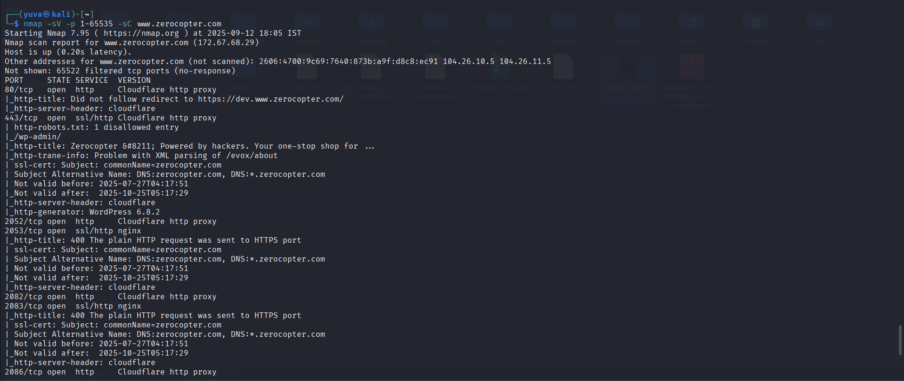

# CYBER SECURITY INTERNSHIP  
## Assignment 4 – Active Reconnaissance  

### 🎯 Objective
The goal of this assignment is to perform **Active Reconnaissance** on a given target, identify live hosts, enumerate open ports and services, perform HTTP directory brute-forcing, and fingerprint the web application with vulnerability checks.  

Target: **www.zerocopter.com**

---

## 🔹 Step 1 — Host Discovery

We first check if the target is alive using **Nmap Ping Scan**.

**Command:**
```bash
nmap -sn www.zerocopter.com
````

**Result:**

* Host is alive.
* IP Address resolved: **172.67.68.29** (with additional Cloudflare IPs).

**Screenshot:**


---

## 🔹 Step 2 — Port & Service Scanning with Nmap

We performed staged scans, starting with a quick SYN scan, then moving to detailed service/version scans.

---

### 2.1 TCP SYN Scan

**Command:**

```bash
nmap -sS www.zerocopter.com
```

**Result:**

* Host responded with multiple filtered and open ports.
* Confirms that the system is actively filtering/protecting ports (Cloudflare).

**Screenshot:**


---

### 2.2 Version & Service Detection on Common Ports

**Command:**

```bash
nmap -sV -p 22,80,443 -sC www.zerocopter.com
```

**Result:**

* Port 80 (HTTP) → Cloudflare proxy, redirecting to HTTPS.
* Port 443 (HTTPS) → Cloudflare SSL, WordPress detected, robots.txt present.
* Port 22 (SSH) → Appears filtered.

**Screenshot:**


---

### 2.3 Full Port Scan with Default NSE Scripts

**Command:**

```bash
nmap -sV -p 1-65535 -sC www.zerocopter.com
```

**Result (Key Findings):**

* **80/tcp** → HTTP (Cloudflare proxy), redirect to HTTPS.
* **443/tcp** → HTTPS (Cloudflare proxy, WordPress 6.8.2).
* **2052/tcp** → HTTP (Cloudflare proxy).
* **2053/tcp** → HTTPS (nginx).
* **2082/tcp** → HTTP (Cloudflare proxy).
* **2083/tcp** → HTTPS (nginx).
* **2086/tcp** → HTTP (Cloudflare proxy).
* **2087/tcp** → HTTPS (nginx).
* **2095/tcp** → HTTP (Cloudflare proxy).
* **2096/tcp** → HTTPS (nginx).
* **8080/tcp** → HTTP (Cloudflare proxy).
* **8443/tcp** → HTTPS (Cloudflare proxy).
* **8880/tcp** → HTTP (Cloudflare proxy).

> SSL certificates were valid and issued for `zerocopter.com` and `*.zerocopter.com`.
> All HTTPS ports responded with Cloudflare/nginx errors when accessed incorrectly (indicating strict SSL enforcement).

**Screenshot:**


---

### 2.4 Full TCP Port Scan (`-p-`)

**Command:**

```bash
nmap -sV -p- www.zerocopter.com
```

**Result:**
Confirmed the same open ports as above (80, 443, 2052–2096, 8080, 8443, 8880).

**Screenshot:**


---

### 2.5 OS Detection

**Command:**

```bash
nmap -O --osscan-guess www.zerocopter.com
```

**Result:**

* OS fingerprinting was **inconclusive** (as expected due to Cloudflare proxy protection).

**Screenshot:**


---

## 🔹 Step 3 — HTTP Enumeration (Dirb)

We used **Dirb** for brute-forcing hidden directories and files.

**Command:**

```bash
dirb https://www.zerocopter.com /usr/share/dirb/wordlists/common.txt
```

**Result:**

* Found accessible directories:

  * `/wp-admin/`
  * `/robots.txt` → disallows `/wp-admin/`
  * `/about/`

**Screenshot:**


---

## 🔹 Step 4 — Web Fingerprinting & Vulnerability Scanning

### 4.1 WhatWeb

**Command:**

```bash
whatweb https://www.zerocopter.com
```

**Result:**

* CMS: **WordPress 6.8.2**
* Web Server: **Cloudflare Proxy + nginx backend**
* SSL: Valid certificates with SAN for `zerocopter.com` and subdomains.

**Screenshot:**


---

### 4.2 Nikto Scan

**Command:**

```bash
nikto -h https://www.zerocopter.com -o nikto.txt
```

**Result (Summary):**

* Found `/robots.txt` disallowing `/wp-admin/`.
* WordPress detected, which may expose version-based vulnerabilities if not patched.
* No critical misconfigurations detected due to Cloudflare protection.

**Screenshot:**


---

## 📌 Final Findings

* The host is **alive** and protected behind **Cloudflare WAF/Proxy**.
* Multiple **HTTP(S) ports** (80, 443, 2052–2096, 8080, 8443, 8880) were found open, all handled by Cloudflare/nginx.
* **WordPress CMS (v6.8.2)** identified on HTTPS (port 443).
* No direct OS or backend server information could be fingerprinted (due to Cloudflare).
* Basic directory enumeration revealed standard files (`robots.txt`, `wp-admin/`).
* Nikto scan confirmed WordPress setup and restricted admin panel access.

---

## 📂 Deliverables

* **images/** → Contains all screenshots (`host_discovery.png`, `nmap_syn_scan.png`, `nmap_service_common.png`, `nmap_full_scan.png`, `nmap_tcp_all.png`, `nmap_os.png`, `dirb_scan.png`, `whatweb.png`, `nikto_scan.png`).
* **nikto.txt** → Raw vulnerability scan report generated by Nikto.
* **Active\_Recon\_Report.md** → This markdown file (main report).

---


