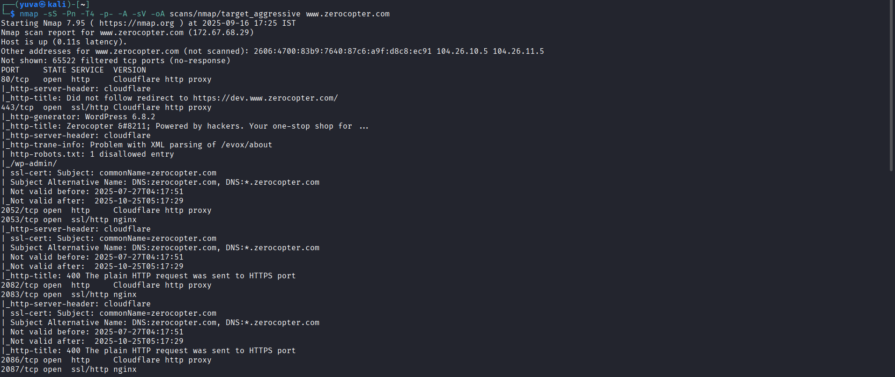
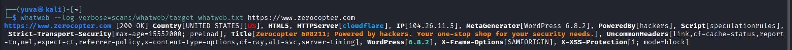
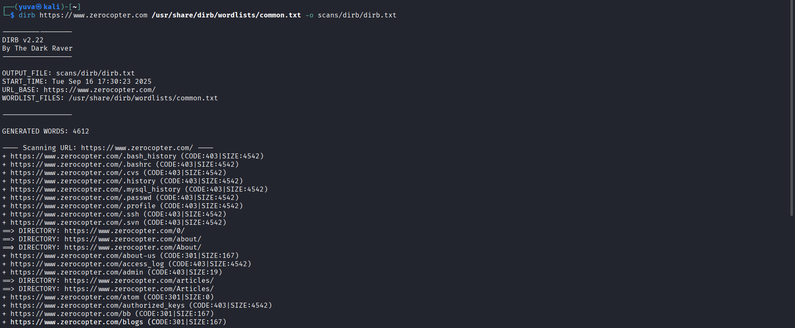
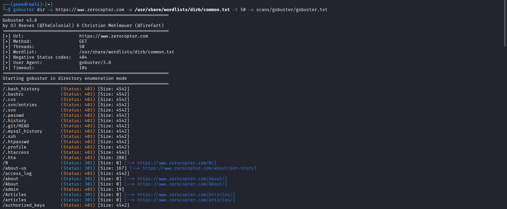
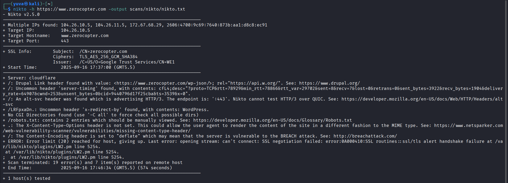
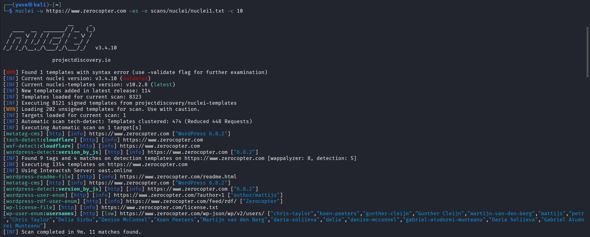
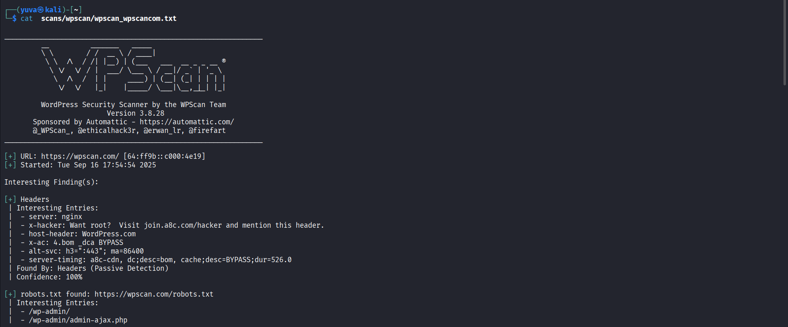

# CYBER SECURITY INTERNSHIP  
## ASSIGNMENT 5 - AUTOMATION SCANNING  

---

### 1. Nmap Results
- **Command (Aggressive Scan):**  
  `nmap -sS -Pn -T4 -p- -A -sV -oA scans/nmap/target_aggressive www.zerocopter.com`  
- **Open Ports & Services:**  
  - `80/tcp` → HTTP (Cloudflare Proxy, redirects to HTTPS)  
  - `443/tcp` → HTTPS (Cloudflare Proxy, WordPress 6.8.2)  
  - `2052, 2082, 2086` → HTTP (Cloudflare Proxies)  
  - `2053, 2083, 2087` → HTTPS (nginx + Cloudflare)  
- **SSL Certificate:**  
  - Valid for `zerocopter.com` and `*.zerocopter.com`  
  - Expiry: **Oct 25, 2025**  

**Screenshot Placeholder:**  


---

### 2. WhatWeb Results
- **Identified Technologies:**  
  - **WordPress 6.8.2** (MetaGenerator)  
  - **Cloudflare CDN & WAF**  
  - Security Headers: `X-Frame-Options`, `X-XSS-Protection`, `Strict-Transport-Security`  
  - Title: *Zerocopter – Powered by hackers. Your one-stop shop for your security needs.*  

**Screenshot Placeholder:**  


---

### 3. Directory Enumeration (Dirb & Gobuster)
- **Sensitive Files (403 Forbidden):**  
  - `.bash_history`, `.bashrc`, `.profile`, `.history`  
  - `.ssh/`, `.svn/`, `.cvs/`  
  - `.passwd`, `.mysql_history`  
  - `.htaccess`, `.htpasswd`  
  - `access_log`, `error_log`, `id_rsa`  
- **Interesting Endpoints:**  
  - `/admin` (403)  
  - `/dashboard` → redirects to `/wp-admin/`  
  - `/login` → redirects to `wp-login.php`  
  - `/about-us`, `/articles`, `/contact`, `/faq`, `/blogs`  

**Screenshot Placeholders:**  

 

---

### 4. Nikto Results
- **Key Findings:**  
  - `robots.txt` → contains restricted paths (`/wp-admin/`)  
  - **Missing `X-Content-Type-Options` header** (may lead to MIME sniffing)  
  - **BREACH Attack possibility** (due to content compression)  
  - `server-timing` and uncommon headers detected  
  - Errors due to SSL handshake during extended probing  

**Screenshot Placeholder:**  


---

### 5. Nuclei Results
- **CMS Detection:** WordPress 6.8.2  
- **Exposed Files:**  
  - `/readme.html`, `/license.txt`  
- **User Enumeration:**  
  - Users discovered via API & feeds (`/wp-json/wp/v2/users/`, `/feed/rdf/`)  
  - Example: `chris-taylor`, `koen-peeters`, `martijn-van-den-berg`, `delia`, `daria-soliieva`, etc.  

**Screenshot Placeholder:**  
 

---

### 6. WPScan Results
- **Robots.txt Findings:**  
  - `/wp-login.php`, `/wp-admin/`, `/wp-signup.php`  
- **Headers:**  
  - `x-hacker` → Promotional header (WordPress.com)  
  - `host-header: WordPress.com`  
- **WordPress Detected with Cloudflare & nginx Backend**  

**Screenshot Placeholder:**  


---

## Summary of Key Findings
1. **WordPress 6.8.2 detected** → Needs continuous patching.  
2. **Sensitive files & directories exposed (403)** → Good that access is restricted, but exposure in responses is an indicator of weak configurations.  
3. **User Enumeration possible** via `/wp-json/wp/v2/users/` → May allow targeted brute-force or phishing attacks.  
4. **Missing Security Header** (`X-Content-Type-Options`) → Potential MIME-based attacks.  
5. **BREACH Attack risk** due to compression.  

---

## Recommendations
- Regularly update WordPress & plugins.  
- Block access to sensitive paths (`.git`, `.ssh`, `.htpasswd`, `.svn`, etc.) at the web server level.  
- Disable verbose error responses and uncommon headers.  
- Implement rate-limiting on WordPress login endpoints.  
- Add missing security headers (`X-Content-Type-Options`, `Content-Security-Policy`).  
- Monitor SSL certificate renewal process.  

---

## Evidence Screenshots
- images/nmap_aggressive.png
- `images/whatweb.png`  
- `images/dirb.png`  
- `images/gobuster.png`  
- `images/nikto.png`  
- `images/nuclei.png`  
- `images/wpscan.png`  

---
```


