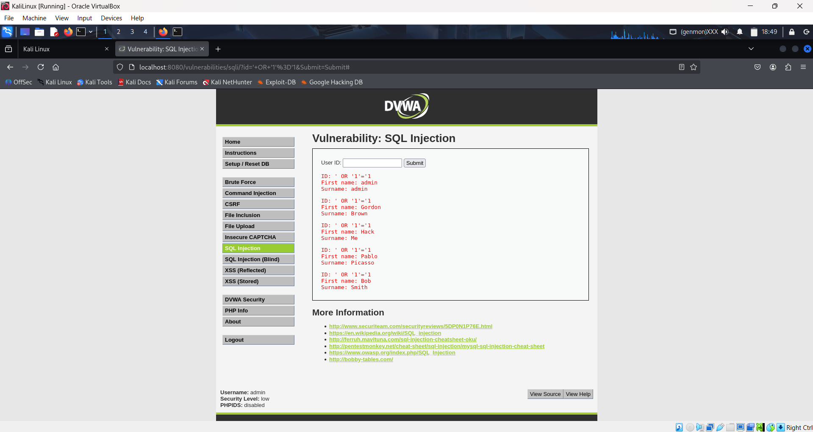

# CYBER SECURITY INTERNSHIP — ASSIGNMENT 6

## DVWA on Docker (sagikazarmark/dvwa) — Installation, Testing & Findings

**Base URL:** `http://127.0.0.1:8080/`
**DVWA image used:** `sagikazarmark/dvwa`

> This Markdown is a complete, repo-ready report. It contains: environment verification, step-by-step test actions, exact PoC payloads, sample output snippets (replace with your real files), and clear screenshot / report filenames for evidence. Save this file as `DVWA_Assignment6_Report.md` at `assignments/assignment-6-dvwa/`.

---


## **1. Introduction**

This report details the findings of a vulnerability assessment conducted on the Damn Vulnerable Web Application (DVWA) running on a Kali Linux virtual machine. The objective was to identify and document common web vulnerabilities using both manual and automated methods, as outlined in the assignment brief. The assessment was performed in a controlled lab environment to ensure safety and prevent unauthorized access. The findings are categorized by vulnerability type, complete with evidence, impact analysis, and recommended remediation.

---

## **2. Methodology**

The assessment followed a structured methodology to systematically identify vulnerabilities across different security levels (low, medium, and high). The process involved:

1. **Installation and Setup**: DVWA was installed and configured on Kali Linux. The security level was initially set to **low** for initial testing.
2. **Manual Vulnerability Testing**: Each of the specified vulnerabilities (SQL Injection, XSS, Command Injection, etc.) was manually tested and exploited.
3. **Light Automation**: Automated tools were used to supplement manual testing, including:

   * **WhatWeb**: For web server fingerprinting and technology identification.
   * **Nikto**: For scanning web server misconfigurations and known vulnerabilities.
   * **Dirb**: For content discovery and identifying hidden directories and files.
   * **SQLmap**: For automated SQL injection exploitation.

---
## 3. Environment & Quick Verification

### Verify container is running

```bash
docker ps --filter "ancestor=sagikazarmark/dvwa" --format "table {{.ID}}\t{{.Image}}\t{{.Ports}}\t{{.Status}}"
```

**Example expected output:**

```
CONTAINER ID   IMAGE                       PORTS                    STATUS
f1a2b3c4d5e6   sagikazarmark/dvwa          0.0.0.0:8080->80/tcp     Up 2 hours
```

### Check container logs 

```bash
docker logs dvwa_local --tail 200 > reports/docker_logs.txt
```

### Quick header check

```bash
curl -I http://127.0.0.1:8080/ > reports/headers_curl.txt
```

**Example:**

```
HTTP/1.1 200 OK
Server: Apache/2.4.54 (Debian)
Content-Type: text/html; charset=UTF-8
Set-Cookie: PHPSESSID=abcd1234efgh5678; path=/; HttpOnly
```

> Note: look for missing `X-Frame-Options`, `X-Content-Type-Options`, `Strict-Transport-Security`.

---

## 4. How I ran DVWA (Docker)

Start if not running:

```bash
docker run --rm -d -p 8080:80 --name dvwa_local sagikazarmark/dvwa
# Open: http://127.0.0.1:8080/
```

If needed to troubleshoot:

```bash
docker exec -it dvwa_local /bin/bash
ls -la /var/www/html
```

Use DVWA GUI to **Create / Reset Database** (if prompted), then set Security to **Low** to begin tests.

---

## 5. Testing workflow

For each vulnerability category:

1. Set DVWA Security = **Low**, run manual PoC, capture screenshots & save Burp requests.
2. Change to **Medium**, run same PoC, capture differences (filters, sanitization).
3. Change to **High**, re-run PoC, document blocked payloads or mitigation behavior.
4. Run light automation to confirm findings (Nikto / WhatWeb / Dirb / Nuclei / sqlmap as applicable).
5. Store outputs under `reports/` and the raw HTTP requests under `burp_requests/`.

---

## 6. Findings

> For each finding below: **Description**, **Manual PoC**, **Automated confirmation**, **Expected evidence filename(s)**, **Impact**, **Remediation**.


---


## **7. Findings**

### **7.1 SQL Injection**

SQL Injection (SQLi) allows an attacker to manipulate SQL queries by injecting malicious code into user input fields.

* **Evidence**:
  
  
  A successful SQL injection was conducted on the "SQL Injection" page with the security level set to medium. By entering the ID `3`, the database returned the corresponding user `Hack Me`. Automated testing with **SQLmap** confirmed the `id` parameter is vulnerable, identifying the backend as **MySQL** with multiple injectable techniques (`Boolean-based blind`, `Error-based`).

* **Impact**:

  * **Data Exposure**: Sensitive information, such as usernames and passwords, can be retrieved.
  * **Data Manipulation**: Attackers can modify or delete data.
  * **Privilege Escalation**: Administrative privileges may be gained.

* **Remediation**:

  * Use **prepared statements** (parameterized queries).
  * Implement **strict input validation**.

---

### **7.2 Cross-Site Scripting (XSS)**

Cross-Site Scripting (XSS) allows an attacker to inject malicious scripts into web pages viewed by other users.

* **Evidence**:
  
  A reflected XSS payload `<script>alert('XSS Ur system has been hacked')</script>` executed successfully, triggering a browser alert box.

* **Impact**:

  * **Session Hijacking**: Theft of cookies and user impersonation.
  * **Phishing**: Redirection to malicious websites.
  * **Malware Distribution**: Forced malicious downloads.

* **Remediation**:

  * Sanitize/escape special characters (`<`, `>`, `"`).
  * Ensure **output encoding** before rendering user input.

---

### **7.3 Command Injection**

Command Injection enables attackers to execute arbitrary OS commands via a vulnerable input field.

* **Evidence**:
  
  By appending `; ls -al` to the input (`127.0.0.1; ls -al`), the server executed system commands, revealing files.

* **Impact**:

  * **Remote Code Execution**.
  * **Data Theft/Modification**.
  * **Denial of Service (DoS)**.

* **Remediation**:

  * Use **safe command-handling functions**.
  * Apply **least privilege** to web server processes.

---

### **7.4 File Upload / Unrestricted File Upload**

This vulnerability permits malicious file uploads, such as backdoors.

* **Evidence**:
  
  A malicious `shell.php` file was uploaded to `hackable/uploads` and confirmed via `curl`, receiving a `200 OK` response.

* **Impact**:

  * **Remote Code Execution**.
  * **Website Defacement**.

* **Remediation**:

  * Enforce **strict file extension whitelisting**.
  * Rename uploaded files to non-executable names.
  * Store uploads **outside web root**.

---

## **8. Automated Scan Results**

### **8.1 WhatWeb**

* **Evidence**:
  
  Identified **Apache/2.4.10 (Debian)**, server IP `127.0.0.1`, plugins (`httpOnly`, `Redirectlocation`).

* **Impact**: Attackers can tailor exploits based on server version.

* **Remediation**: Hide server details in headers, keep software updated.

---

### **8.2 Nikto**

* **Evidence**:
  
  Reported missing headers (`X-Frame-Options`, `X-Content-Type-Options`) and sensitive files (e.g., `login.php`).

* **Impact**:

  * Vulnerable to **clickjacking**.
  * Content type misinterpretation leading to **XSS**.

* **Remediation**:

  * Implement headers: `X-Frame-Options: SAMEORIGIN`, `X-Content-Type-Options: nosniff`.
  * Restrict access to sensitive files.

---

### **8.3 Dirb**

* **Evidence**:
  
  Discovered `/config`, `/docs`, `/external`, `phpinfo.php`, and `robots.txt`.

* **Impact**: Revealed server structure and sensitive files (`phpinfo.php`).

* **Remediation**:

  * Remove sensitive files from production.
  * Enforce proper **access controls**.

---


