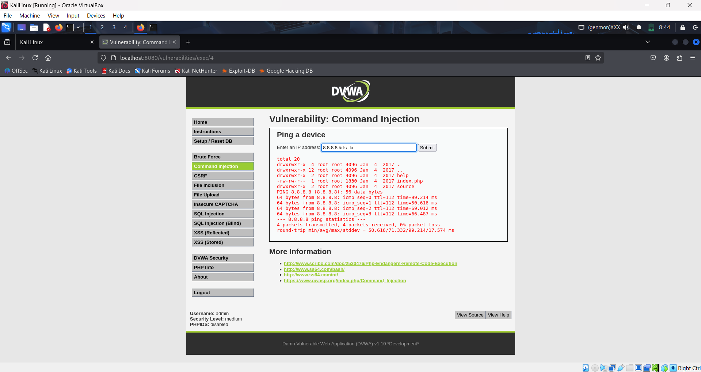

# DVWA — How Defenses Vary by Security Level

*Comprehensive mini research report — repository-ready (Markdown)*

**Author:** Yuvaraj
**Date:** 2025-09-26

---

## Table of Contents

1. Executive summary
2. Overview & intended use
3. Lab safety & deployment checklist
4. Security-level design philosophy
5. Detailed module walkthroughs 

   * 5.1 Command Injection

     * Low (Exploit)
     * Medium (Bypass)
     * High (Mitigation & Verification)
     * Mitigation Steps (detailed)
   * 5.2 SQL Injection

     * Low (Exploit)
     * Medium (Bypass)
     * High (Mitigation & Verification)
     * Mitigation Steps (detailed)
6. Payload catalog (tested examples)
7. Code fixes & safe patterns (copy-paste ready)
8. Instructor notes and suggested exercises

---

## 1. Executive summary

This extended report explains how DVWA implements progressive defenses across its configurable security levels (Low, Medium, High, Impossible) and provides a step-by-step lab guide for instructors and students. Each vulnerability module (we focus on Command Injection and SQL Injection) includes: a detailed exploit walkthrough, recommended payloads, sample screenshots placeholders for evidence, robust mitigation steps, and secure remediation examples. The document is intended to be uploaded to a GitHub repository and used as a lab manual.

---

## 2. Overview & intended use

**What is DVWA?** A deliberately insecure PHP/MySQL application for learning web security.

**Intended audience:** Students, instructors, security practitioners.

**Learning objectives:** recognize vulnerabilities, exploit them in a controlled environment, and implement (or propose) secure fixes.

---

## 3. Lab safety & deployment checklist

* Run DVWA inside a VM or Docker container on an isolated network (NAT or host-only).
* Do **not** expose DVWA to WAN or public networks.
* Snapshot the VM/container before and after exercises.
* Use a non-privileged database/web user for the DVWA instance.
* Keep a lab ledger to track student actions and restore points.

---

## 4. Security-level design philosophy 

* **Low:** intentionally weak; direct interpolation and unsanitized usage of inputs.
* **Medium:** naive mitigations (blacklists, legacy escaping). Useful to teach bypass techniques.
* **High:** stronger, often correct mitigations (validation, parameterization). May contain subtle errors for teaching.
* **Impossible:** fully secured implementation — goal-state.

---

## 5. Detailed module walkthroughs 


### 5.1 Command Injection

**Context:** ping/lookup feature that executes an OS command using user-supplied input. This section contains: exploitation steps (Low), bypass approaches (Medium), remediation (High) and a detailed Mitigation Steps subsection you can copy into your patch.

#### Low — Demonstration & Exploitation

**Goal:** show how unsanitized input leads to shell command execution.

**Steps:**

1. Set DVWA Security to **Low** (DVWA -> Security).
2. Navigate to the Command Injection page ("Command Injection" menu).
3. In the IP field enter a benign value (e.g., `8.8.8.8`) and click "Submit" to observe expected behavior.

 

4. View source code for analysis.

  

5. Now enter a chaining payload to demonstrate arbitrary command execution, Capture server response, and note any sensitive information printed (avoid real secrets).


.

**Analysis points to document:** command concatenation pattern, PHP function used (`shell_exec`, `system`, backticks), user privileges of web server process.

---

#### Medium — Bypassing naive filters

**Context:** the app applies basic blacklists (removing `;`, `|`, etc.). Show how encodings / alternate syntax bypass it.

**Steps:**

1. Set DVWA Security to **Medium**.
2. Try simple bypasses:

   * Encodings: `%3B` for `;` (e.g., `8.8.8.8%3Bid`)
   * Subshells: `8.8.8.8 $(id)`
   * Backticks: ``8.8.8.8 `id` ``
3. View source code for analysis.

  

4. Enter payload and exploit vulnerability,Show a successful bypass and capture output.

  

---

#### High — Proper mitigation & verification

**Context:** the app validates IP addresses or replaces shell usage with native functions.

**Steps:**

1. Set DVWA Security to **High**.
2. Enter invalid payloads from previous steps and confirm they are rejected. 
3. Review server-side code (if available) showing validation using `filter_var($ip, FILTER_VALIDATE_IP)` or use of sockets.

  

5. Demonstrate a safe alternative (example code below) by patching a copy of the vulnerable script and re-testing with malicious payload — it should be rejected.

  

**Verification checklist:**

* Inputs validated against strict whitelist.
* No direct shell invocation with user input.
* Logs record rejected inputs (server-side logs).

---

#### Mitigation Steps — Command Injection 

Use this checklist when patching vulnerable code. These steps are ordered from highest-impact/least-effort to optional hardening controls:

1. **Remove shell usage entirely if possible.**

   * Replace `shell_exec()`/`system()` calls with native language APIs or libraries. For network checks use sockets (`fsockopen`, `stream_socket_client`) or ICMP libraries instead of `ping` binaries.
   * Example: use `fsockopen($ip, 80, $errno, $errstr, $timeout)` to attempt a connection.

2. **Strict whitelist validation & canonicalization.**

   * For IPs: `filter_var($ip, FILTER_VALIDATE_IP, FILTER_FLAG_IPV4)` or `inet_pton()`; reject everything else.
   * Trim input, normalize encodings (percent-decoding), and reject control characters.
   * Enforce length limits and allowed character classes (digits + dot for IPv4).

3. **If an external binary is unavoidable, call it securely.**

   * Use process APIs that avoid the shell (e.g., `proc_open()` with an argument array or `execv` equivalents in other languages).
   * Use absolute binary paths (`/bin/ping`) and drop privileges before executing.
   * Wrap calls in strict timeouts and resource limits.

4. **Escape and isolate outputs.**

   * Never reflect raw command output into HTML without escaping (`htmlspecialchars()`), and avoid printing OS errors verbatim.
   * Sanitize any logged outputs to avoid log injection.

5. **Principle of least privilege and runtime confinement.**

   * Run the web process under a restricted user, and use AppArmor/SELinux profiles to constrain permitted binaries and network access.
   * Remove SUID binaries from the runtime environment where possible.

6. **Logging, detection, and rate limiting.**

   * Log rejected inputs and suspicious patterns (repeated meta-characters, long non-IP strings).
   * Implement rate limiting on ping/diagnostic endpoints to prevent abuse.

7. **Testing & CI integration.**

   * Add automated tests that assert invalid IPs are rejected and that shell commands are not executed during input handling.
   * Include unit tests for canonicalization and fuzz tests for malicious payloads.

8. **Operational controls.**

   * Use network-level controls (firewalls) to restrict outgoing connections from the web host when tests shouldn't make network calls.
   * For training environments, snapshot/restore and keep logs of student activity.

**Verification steps after patching:**

* Attempt previous exploit payloads; they must be rejected or not executed.
* Review logs to ensure rejected input is recorded.
* Run unit tests and CI checks.

---

### 5.2 SQL Injection

**Context:** typical login or ID lookup page where user input is concatenated into SQL queries.

#### Low — Demonstration & Exploitation

**Steps:**

1. Set DVWA Security to **Low**.
2. Go to SQL Injection module.

  

3. View source code for analysis.

  

4. Enter `1 OR 1=1` (or `1' OR '1'='1`) in the input and submit. Capture the result proving unauthorized data disclosure (multiple rows, admin access, etc.).

  

---

#### Medium — Interception & bypassing UI constraints

**Context:** medium adds `mysql_real_escape_string()` or renders inputs as dropdowns; still bypassable.

**Steps:**

1. Set security level to **Medium**.
2. View target page for analysis functionality.

  

3. If the input is dropdown-based, intercept the POST using Burp and replace parameter with a crafted payload (e.g., `1 UNION SELECT user, password FROM users`).

 

4. Show successful exploitation where applicable and capture evidence.

  

---

#### High — Parameterized queries and testing

**Context:** high level should use prepared statements / parameterized queries.

**Steps:**

1. Set security level to **High**.
2. View target web for analysis of functionality.

  

3. View source page code for analysis.

  

4. Attempt payload and exploit vulnerabilities.

  


**Verification checklist:** prepared statements used; DB account privileges are limited; error messages are generic.

---

#### Mitigation Steps — SQL Injection 

Adopt the following layered steps to harden any SQL-using codebase. Apply multiple layers — not just one.

1. **Parameterized queries / prepared statements (primary defense).**

   * Use PDO or mysqli prepared statements with bound parameters for all dynamic queries. Never construct SQL by concatenating user input.
   * Example: `$stmt = $pdo->prepare('SELECT * FROM users WHERE id = :id'); $stmt->execute(['id'=>$id]);`

2. **Input validation & canonicalization (secondary defense).**

   * For numeric IDs enforce intval checks or regex-based whitelist. For strings, restrict length and allowed characters.
   * Canonicalize encodings and normalize Unicode to prevent alternate-encoding attacks.

3. **Least privilege database accounts.**

   * Use DB users with minimal rights — no FILE, SUPER or DDL where not required. Create separate readonly accounts for queries that don't need write access.

4. **Disable dangerous DB functions.**

   * Remove or revoke access to functions like `LOAD_FILE`, `INTO OUTFILE`, or enable SQL modes that restrict file access.

5. **Safe error handling.**

   * Do not return DB stack traces or SQL errors to users. Return generic error messages and log details server-side.
   * Log query attempts that look suspicious (e.g., contain `UNION`, `SELECT` keywords in unexpected places).

6. **WAF & runtime protections.**

   * Deploy Web Application Firewall rules to block common SQLi patterns as an additional layer (not a replacement).
   * Use runtime application self-protection (RASP) if available to detect malicious query patterns.

7. **Testing: SAST/DAST and fuzz testing.**

   * Integrate static analyzers and dynamic scanners into CI. Run SQLi fuzz tests and unit tests targeting query-building code.
   * Add regression tests ensuring prepared statements are used.

8. **Logging, monitoring & alerting.**

   * Log suspicious parameter patterns, rate of failed requests, and unusual query shapes. Feed logs into SIEM/alerting for triage.

9. **Code review & secure libraries.**

   * Prefer ORM or query builders that inherently parameterize queries, but review generated SQL.
   * Conduct regular code reviews focusing on any raw query concatenation.

**Verification steps after patching:**

* Run the same payloads used during exploitation; they must no longer alter query behavior or reveal data.
* Run CI DAST tests and confirm no SQLi findings.
* Check DB privileges and confirm restricted permissions.

---

## 6. Payload catalog (tested examples)

**Command Injection**

* `8.8.8.8; id`
* `8.8.8.8 && ls -la /`
* `8.8.8.8 $(id)`
* Encoded: `8.8.8.8%3Bid`

**SQL Injection**

* `1 OR 1=1`
* `1' OR '1'='1`
* `1 UNION SELECT null, user, password FROM users -- `
* Second-order payloads: stored in one field and triggered by another query

> Always test payloads in a safe environment. Do not reuse against production.

---

## 7. Code fixes & safe patterns 

**Command Injection — safer approach (PHP example)**

```php
$ip = $_GET['ip'] ?? '';
if (!filter_var($ip, FILTER_VALIDATE_IP)) {
  echo 'Invalid IP';
  exit;
}
// Example: use fsockopen for reachability checking instead of shell_exec
$fp = @fsockopen($ip, 80, $errno, $errstr, 2);
if ($fp) {
  fclose($fp);
  echo 'host reachable';
} else {
  echo 'not reachable';
}
```

**Command Injection — secure external process invocation (if unavoidable)**

```php
$cmd = '/bin/ping';
$args = array('-c', '1', $ip);
// use proc_open or specific library that accepts argument arrays and avoids shell
// Example pseudo-code: run_process($cmd, $args, $timeout=3);
```

**SQL Injection — safe PDO pattern**

```php
$stmt = $pdo->prepare('SELECT * FROM users WHERE id = :id');
$stmt->execute(['id' => (int)$_GET['id']]);
$user = $stmt->fetch();
```

**Additional notes:** remove any DB functions with file system or OS access (`LOAD_FILE`, `INTO OUTFILE`) from the training DB user account.

---

## 8. Instructor notes and suggested exercises

**Exercises (per module):**

* Students must: exploit Low, bypass Medium, and demonstrate High prevention by patching sample code.
* For extra credit: propose a logging/alerting rule (e.g., detect repeated ping requests with shell meta characters) and provide a sample regex.

---


